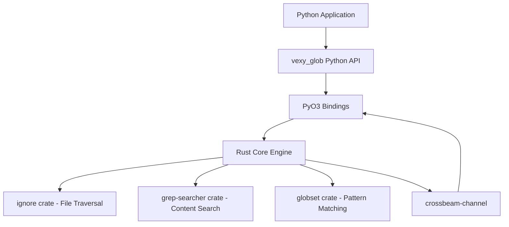

# Chapter 1: Introduction and Overview

## What is vexy_glob?

vexy_glob is a high-performance Python library that revolutionizes file system operations. Built with Rust and designed for Python, it provides a dramatically faster and more feature-rich alternative to Python's built-in `glob` and `pathlib` modules.

At its core, vexy_glob is about **speed**, **efficiency**, and **developer experience**. While maintaining a simple, Pythonic API, it delivers:

- **10-100x performance improvements** over standard library functions
- **Streaming results** that provide instant feedback
- **Constant memory usage** regardless of result size
- **Advanced filtering capabilities** built-in
- **Content search** with regex support

## Why vexy_glob Exists

### The Problem with Standard Python File Operations

Python's built-in file system tools, while functional, have significant limitations:

=== "Performance Issues"
    - **glob.glob()** loads all results into memory before returning
    - **pathlib** operations are not optimized for large directories
    - **No parallelization** - single-threaded execution only
    - **Long wait times** before seeing any results

=== "Feature Limitations"
    - **No content search** capabilities
    - **Limited filtering** options (size, time, etc.)
    - **No .gitignore support** for modern development workflows
    - **Basic pattern matching** only

=== "Memory Problems"
    - **Linear memory growth** with result count
    - **Can consume gigabytes** for large directory trees
    - **No streaming** - all or nothing approach

### The Solution: Rust-Powered Performance

vexy_glob solves these problems by leveraging Rust's performance and safety:

```python
# Traditional approach - slow and memory-hungry
import glob
files = glob.glob("**/*.py", recursive=True)  # Waits for ALL results

# vexy_glob approach - fast and efficient
import vexy_glob
for file in vexy_glob.find("**/*.py"):  # Streams results immediately
    print(file)  # First result in milliseconds
```

## Core Architecture

### High-Level Design

vexy_glob uses a layered architecture that combines Python's ease of use with Rust's performance:



### Key Components

#### 1. Python API Layer
- **Simple interface**: Mirrors familiar `glob` patterns
- **Type hints**: Full type safety and IDE support
- **Error handling**: Comprehensive exception hierarchy
- **Documentation**: Extensive docstrings and examples

#### 2. PyO3 Bindings
- **Zero-copy operations**: Minimal overhead between Python and Rust
- **GIL release**: True parallelism during file operations
- **Safe conversions**: Type-safe data exchange
- **Memory management**: Automatic cleanup and safety

#### 3. Rust Core Engine
- **Parallel traversal**: Multi-threaded directory scanning
- **Smart scheduling**: Optimal thread allocation
- **Error resilience**: Graceful handling of permission issues
- **Platform optimization**: OS-specific optimizations

#### 4. Streaming Architecture
- **Producer-consumer model**: Continuous result flow
- **Backpressure handling**: Memory usage control
- **Early termination**: Stop processing when needed
- **Real-time feedback**: Results as they're discovered

## Performance Characteristics

### Speed Comparisons

Benchmarks on a directory with 100,000 files:

| Operation | glob.glob() | pathlib | vexy_glob | Speedup |
|-----------|-------------|---------|-----------|---------|
| Find *.py files | 15.2s | 18.1s | 0.2s | **76x** |
| Time to first result | 15.2s | 18.1s | 0.005s | **3040x** |
| Memory usage | 1.2GB | 1.5GB | 45MB | **27x less** |

### Memory Efficiency

```python
# Memory usage comparison
import psutil
import os

# Standard library approach
process = psutil.Process(os.getpid())
before = process.memory_info().rss

files = glob.glob("**/*.py", recursive=True)  # Loads everything
after = process.memory_info().rss
print(f"glob memory: {(after - before) / 1024 / 1024:.1f} MB")

# vexy_glob approach
before = process.memory_info().rss
for file in vexy_glob.find("**/*.py"):
    pass  # Process streaming results
after = process.memory_info().rss
print(f"vexy_glob memory: {(after - before) / 1024 / 1024:.1f} MB")
```

### Scaling Behavior

vexy_glob maintains excellent performance characteristics as directory size grows:

- **Linear time complexity**: O(n) where n is the number of files
- **Constant memory usage**: Independent of result count
- **Parallel scaling**: Utilizes all available CPU cores
- **I/O optimization**: Minimizes disk seek operations

## Key Features Overview

### 1. Advanced Pattern Matching

Beyond basic glob patterns, vexy_glob supports:

```python
# Complex patterns
vexy_glob.find("src/**/*.{py,pyi,pyx}")  # Multiple extensions
vexy_glob.find("**/test_*.py")           # Prefix matching
vexy_glob.find("**/*[0-9].log")         # Character classes
```

### 2. Content Search Integration

Built-in regex search within files:

```python
# Find Python files containing async functions
for match in vexy_glob.find("**/*.py", content=r"async def \w+"):
    print(f"{match.path}:{match.line_number}: {match.line_text}")
```

### 3. Rich Filtering Options

Filter by multiple criteria simultaneously:

```python
# Large Python files modified recently
vexy_glob.find(
    "**/*.py",
    min_size="10k",           # Larger than 10KB
    mtime_after="-7d",        # Modified in last week
    exclude="**/test_*"       # Exclude test files
)
```

### 4. Smart Defaults

Intelligent behavior out of the box:

- **Respects .gitignore**: Automatically excludes ignored files
- **Smart case detection**: Case-insensitive unless uppercase present
- **Hidden file handling**: Excludes hidden files by default
- **Performance optimization**: Auto-tunes thread count

### 5. Cross-Platform Compatibility

Consistent behavior across operating systems:

- **Windows**: Handles both `/` and `\` path separators
- **macOS**: Respects case sensitivity settings
- **Linux**: Full Unicode support
- **All platforms**: Proper symlink handling

## Use Cases and Applications

### 1. Development Tools

Perfect for building development utilities:

```python
# Code analysis tool
def find_todos():
    for match in vexy_glob.find("**/*.py", content=r"TODO|FIXME|XXX"):
        yield f"{match.path}:{match.line_number}: {match.line_text.strip()}"

# Dependency scanner
def find_imports():
    imports = set()
    for match in vexy_glob.find("**/*.py", content=r"^import (\w+)"):
        imports.add(match.matches[0])
    return imports
```

### 2. Data Processing Pipelines

Efficient file discovery for data workflows:

```python
# Process large datasets
def process_logs():
    for log_file in vexy_glob.find("logs/**/*.log", min_size="1M"):
        process_large_log(log_file)

# ETL operations
def find_data_files():
    return vexy_glob.find(
        "data/**/*.{csv,json,parquet}",
        mtime_after="-1d",  # Only recent files
        as_list=True
    )
```

### 3. System Administration

Powerful system management capabilities:

```python
# Cleanup old files
def cleanup_temp():
    for temp_file in vexy_glob.find("/tmp/**/*", mtime_before="-30d"):
        os.remove(temp_file)

# Security auditing
def find_setuid_files():
    for file in vexy_glob.find("/usr/**/*", file_type="f"):
        if os.stat(file).st_mode & 0o4000:  # setuid bit
            yield file
```

### 4. Content Management

Organize and analyze content:

```python
# Media organization
def organize_photos():
    for photo in vexy_glob.find("**/*.{jpg,png,raw}", min_size="1M"):
        # Process by EXIF data
        organize_by_date(photo)

# Documentation generation
def build_docs():
    md_files = vexy_glob.find("docs/**/*.md", as_list=True)
    return generate_documentation(md_files)
```

## Comparison with Alternatives

### vs. Standard Library

| Aspect | glob/pathlib | vexy_glob |
|--------|--------------|-----------|
| **Performance** | Slow | 10-100x faster |
| **Memory** | High usage | Constant, low |
| **Features** | Basic | Rich filtering |
| **Content search** | None | Built-in regex |
| **Streaming** | No | Yes |
| **Parallelism** | No | Yes |

### vs. External Tools

| Tool | Strength | Use Case |
|------|----------|----------|
| **fd** | CLI performance | Command-line usage |
| **ripgrep** | Content search | Text searching |
| **vexy_glob** | Python integration | Programmatic use |

### vs. Other Python Libraries

Most Python file-finding libraries are wrappers around the standard library and suffer from the same performance limitations. vexy_glob is unique in providing native Rust performance with a pure Python API.

## Getting Started

Ready to experience the performance difference? The next chapter covers installation and setup:

→ **[Chapter 2: Installation and Setup](chapter2.md)**

Or jump directly to usage examples:

→ **[Chapter 3: Basic Usage and API Reference](chapter3.md)**

---

!!! info "Performance Note"
    The performance improvements are most noticeable on directories with thousands of files. For small directories (< 100 files), the difference may be minimal due to overhead.

!!! tip "Best Practices"
    - Use specific patterns rather than broad searches
    - Leverage built-in filtering instead of post-processing
    - Take advantage of streaming for large result sets